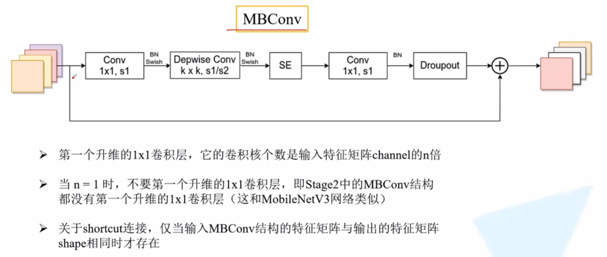
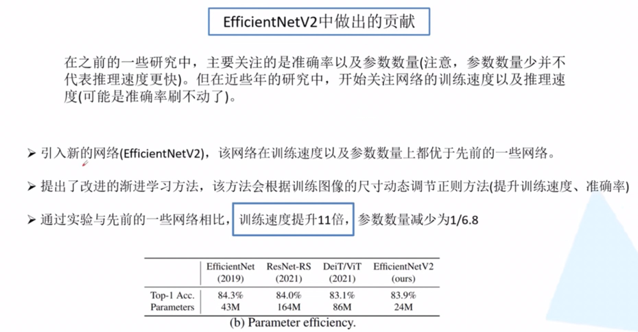
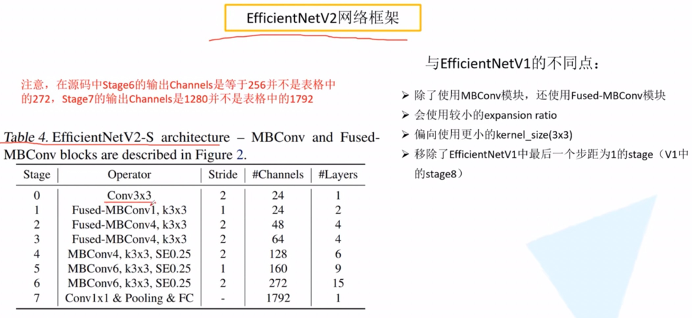
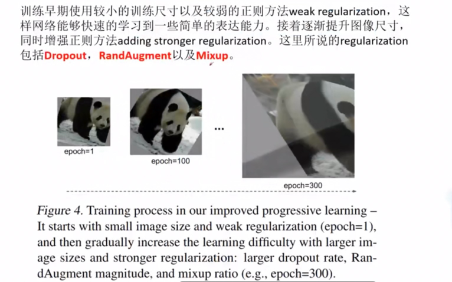

《EfficientNet: Rethinking Model Scaling for Convolutional Neural Networks》 Google 2019年
https://arxiv.org/pdf/1905.11946.pdf
https://blog.csdn.net/qq_37541097/article/details/114434046
同时搜索输入图像分辨率，网络的深度，宽度的影响。

《EfficientNet V2: Smaller Models and Faster Training》 2021CVPR
https://arxiv.org/pdf/2104.00298.pdf
https://blog.csdn.net/qq_37541097/article/details/116933569
引入Fused-MBConv模块（MB指的是MoBile）
引入渐进式学习策略（训练更快）

