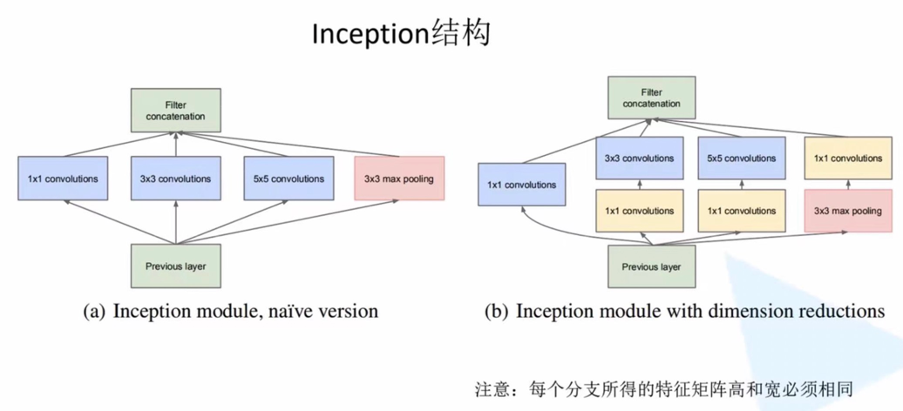
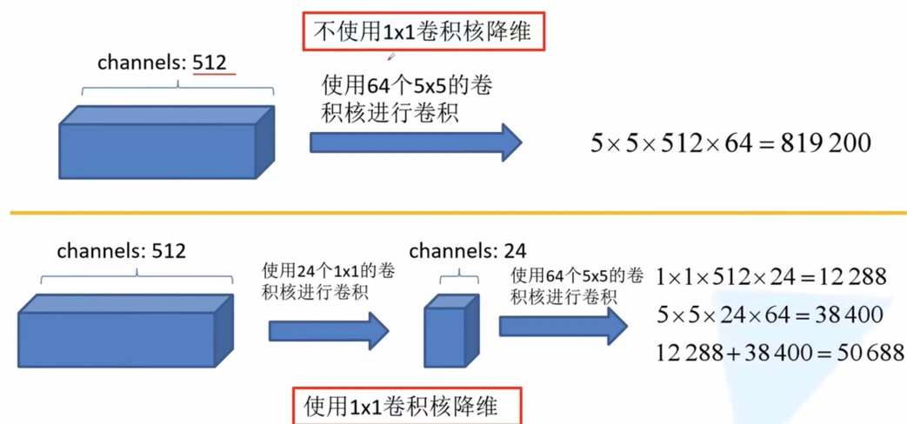
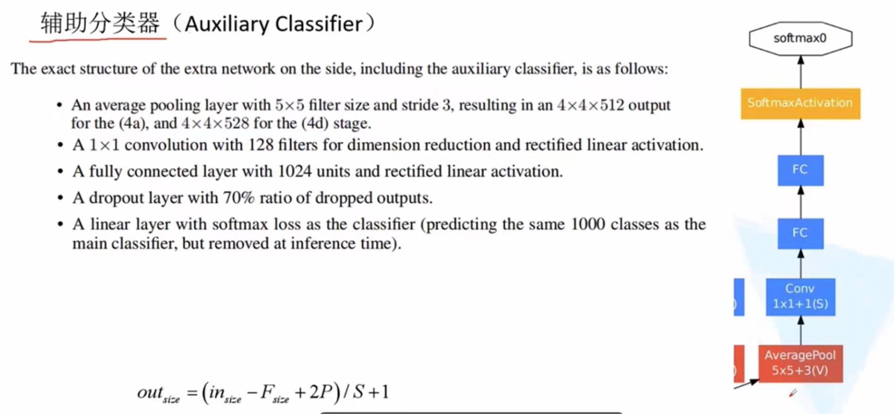

GoogLeNet2014年由GoogLeNet团队提出。
网络亮点：
引入了Inception结构（融合不同尺度的特征信息）；
使用1*1卷积核进行降维以及映射处理；
添加两个辅助分类器帮助训练（AlexNet和VGG都只有一个输出层，GoogLeNet有三个输出层，其中一个主输出层，两个辅助分类层）；
丢弃全连接层，使用平均池化层（大大减少模型参数）。

上图中三个1*1卷积就是为了减少特征矩阵的深度，从而减少卷积参数，也就减少了计算量。

通道数=卷积核的个数！池化操作不会改变特征矩阵的深度！

