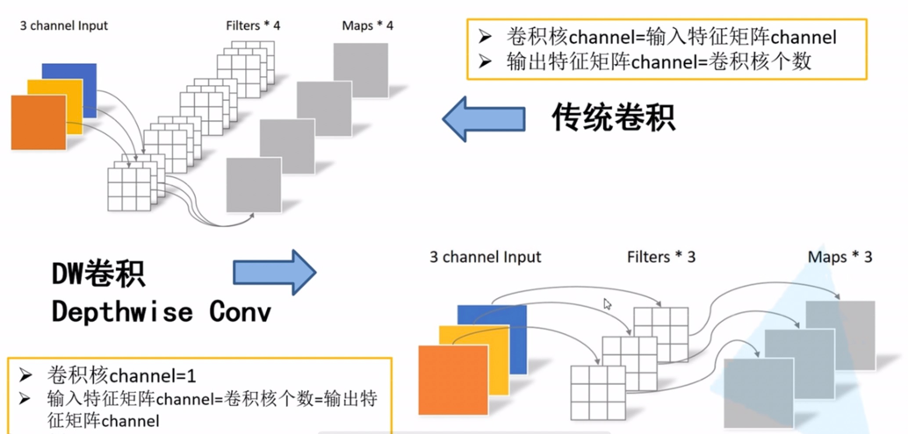
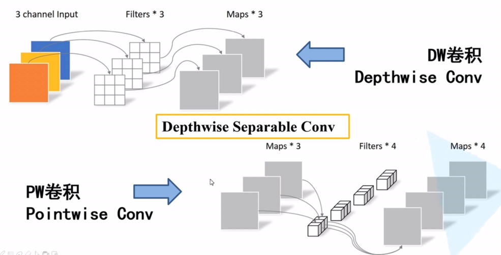
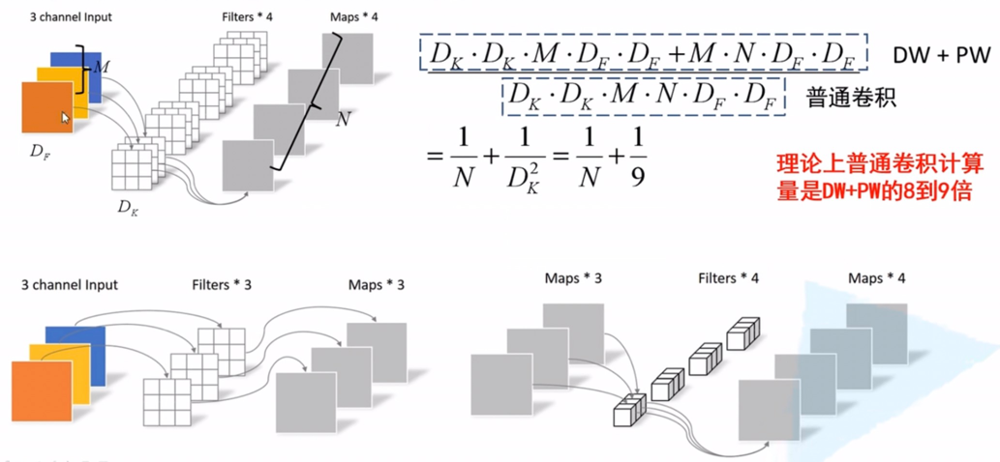
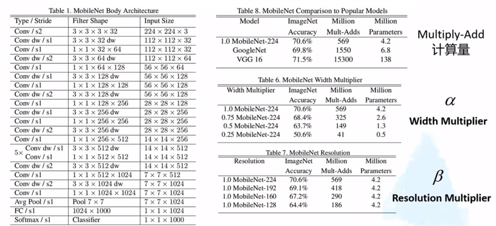
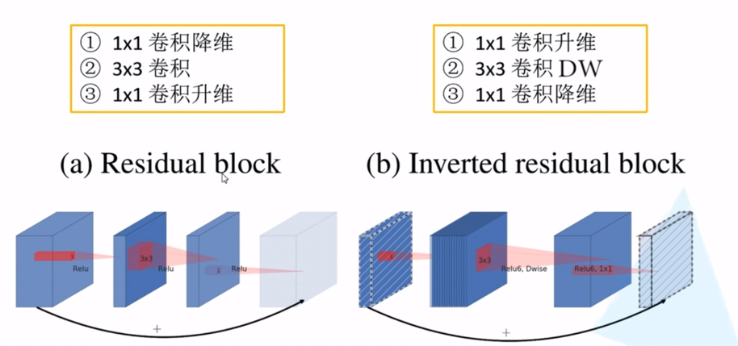
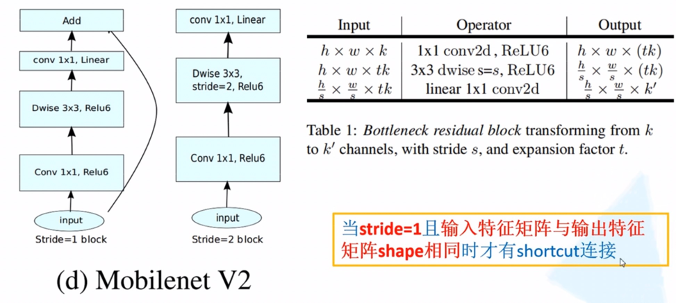

传统卷积神经网络由于内存需求大，运算量大，导致无法在移动设备以及嵌入式设备上运行。我们不能只自嗨于自己的研究，还要能努力创造应用价值。
MobileNet网络是由Google团队在2017年提出的，专注于移动端或者嵌入式设备中的轻量级CNN网络。相比传统卷积神经网络，在准确率小幅降低
的前提下大大减少模型参数与运算量。（相比VGG16准确率减少了0.9%, 但是模型参数只有VGG的1/32）。

MobileNet V1:
《MobileNets: Efficient Convolutional Neural Networks for Mobile Vision Applications》
https://arxiv.org/pdf/1704.04861.pdf
亮点：
Depthwise Convolution（大大减少运算量和参数数量）
增加超参数：α--控制卷积层卷积核个数；β--控制输入图像大小。这两个超参都是人为自己设定的，并不是学习到的。

发现在训练过程中，Depthwise部分的卷积核容易废掉，即卷积核参数大部分为零。

MobileNet V2:
MobileNet V2网络是由Google团队在2018年提出的，相比MobileNet V1网络，准确率更高，模型更小。
《MobileNet V2：Inverted Residuals and Linear Bottlenecks》
https://arxiv.org/pdf/1801.04381.pdf
w网络亮点：
Inverted Residuals(倒残差结构)
Linear Bottlenecks

MobileNet V3:
《Searching for MobileNetV3》
https://arxiv.org/pdf/1905.02244.pdf
亮点：
更新了Block（bneck。加入了SE模块也就是通道自注意力机制模块；更新了激活函数）；
使用NAS搜索参数（Neural Architecture Search）
重新设计耗时层结构。

