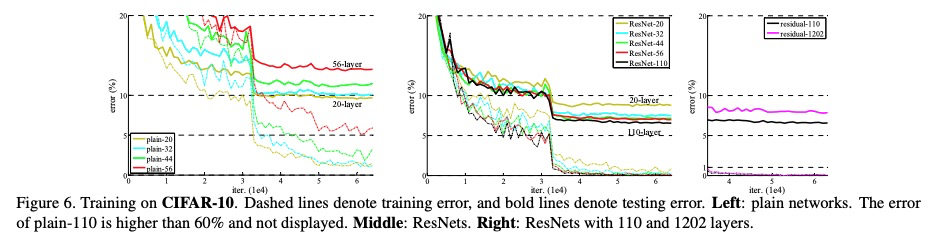

https://arxiv.org/pdf/1512.03385.pdf 《Deep Residual Learning for Image Recognition》 CVPR2016

2015年微软实验室提出，斩获当年imagenet分类&检测任务第一名；coco检测/分割任务第一名。

网络亮点：
超深的网络结构（突破1000层）；
提出residual模块（就是因为有了残差模块，才得以搭建那么深的网络）；

使用batch normalization加速训练（丢弃dropout）。

文章提出随着网络层数加深，网络会出现梯度消失（当每一层梯度是一个小于1的数就会越乘越小）或者梯度爆炸（当每一层梯度是一个大于1的数就会越乘越大）的情况，还会出现退化问题。
退化问题如论文中下图所示：

上图，随着网络层数的加深，训练和测试误差会越来越大。

上图，实线是训练过程，虚线是测试过程，可以看到随着网络层数加深，训练和测试error反而越来越小，可见resent确实解决了网络退化问题。

上图是两种不同类型的残差结构，左图针对网络层数较少的情况，右图针对网络层数较多的情况。
右图中，第一个1x1卷积用于降维(channel from 256 to 64), 第二个1x1卷积用于升维(channel from 64 to 256)。
可以看到左图中网络参数比右图中网络参数多很多，1x1卷积大大减少参数量。
注意：主分支(直线)与shortcut(曲线)的输出特征矩阵shape即[C, H, W]必须相同。 

图中的虚线shortcut输入前后通道（或通道以及宽高）发生了变化，而实线shortcut是没有发生变化的。

batch normalization详细细节参考：
https://blog.csdn.net/qq_37541097/article/details/104434557（非常好）
https://www.bilibili.com/video/av9770302?p=10

ResNeXt:
convolution ===> group convolution

