《ShuffleNet: An Extremely Efficient Convolutional Neural Network for Mobile Devices》 2017年
https://arxiv.org/pdf/1707.01083.pdf
提出了channel shuffle的思想；
ShuffleNet Unit中全是GConv和DWConv。

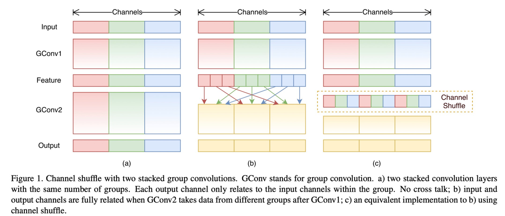
GConv虽然能减少参数与计算量，但GConv中不同组之间信息没有交流。

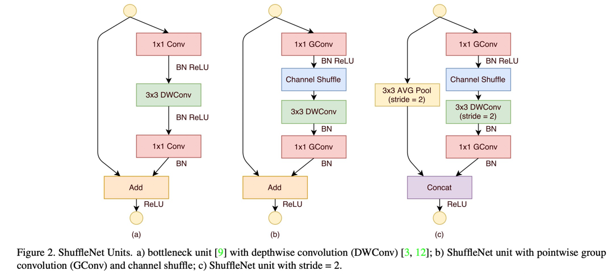
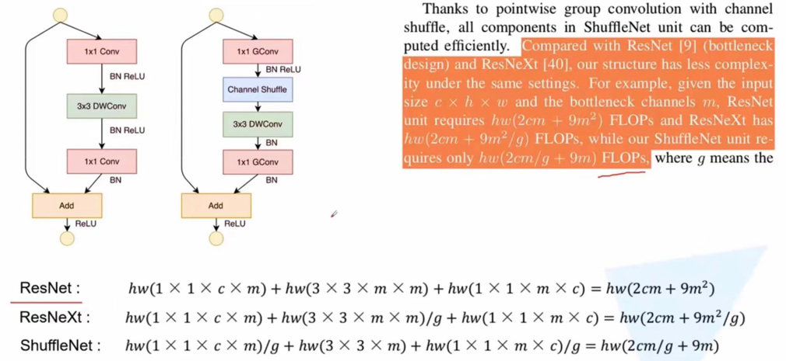

《ShuffleNet V2：Practical Guidelines for Efficient CNN Architecture Design》 ECCV2018
https://arxiv.org/pdf/1807.11164.pdf
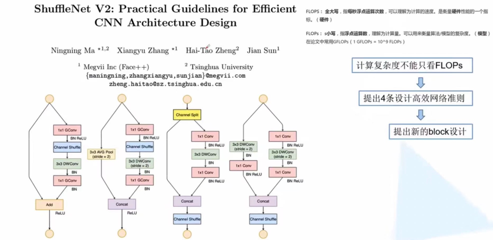
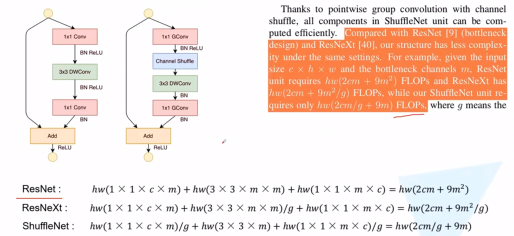

several practical guidelines for efficient network architecture design：
G1：Equal channel width minimizes memory access cost(MAC).
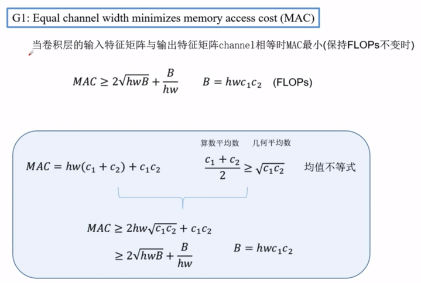

G2：Excessive group convolution increases MAC.
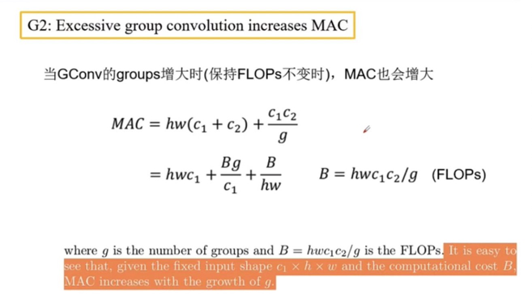

G3：Network Fragmentation reduces degree of parallelism.
网络设计的碎片化程度越高，速度越慢。
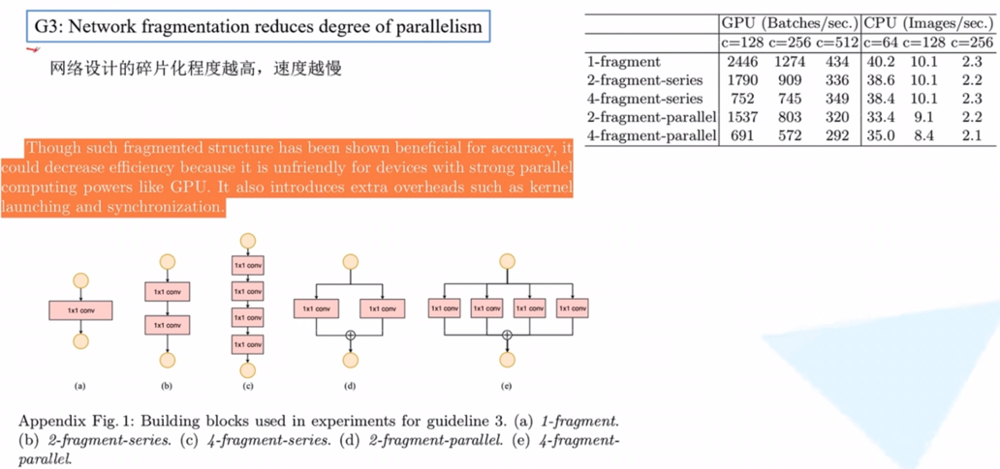

G4：Element-wise operations are non-negligible. 
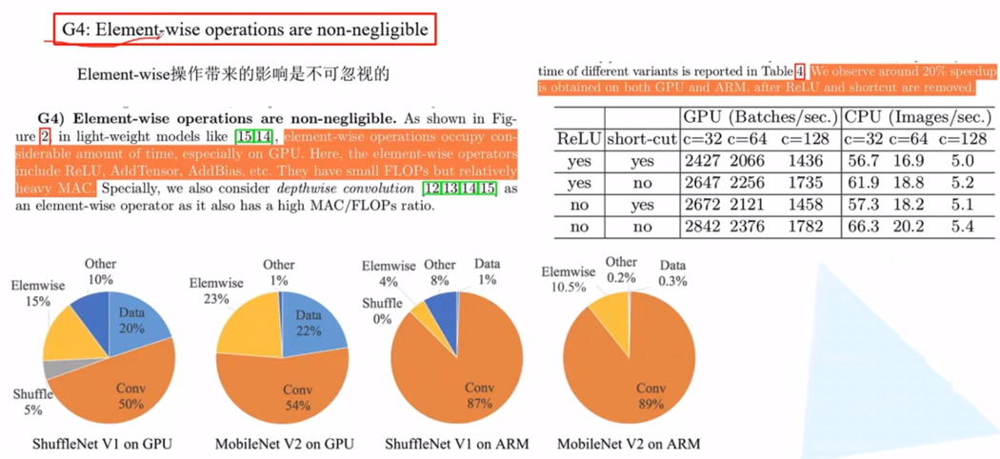

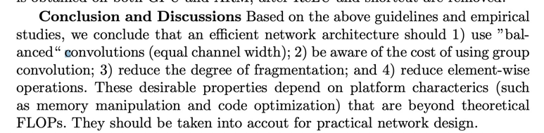
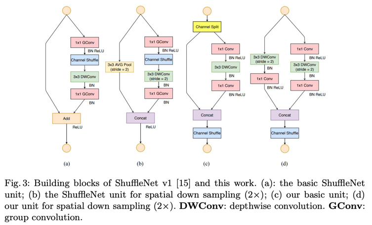