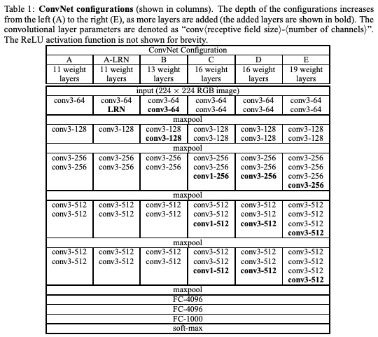
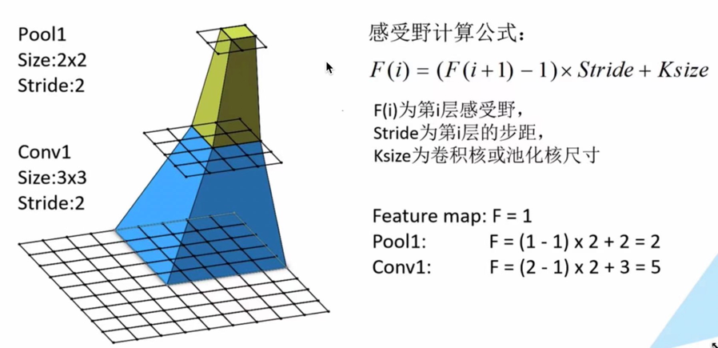
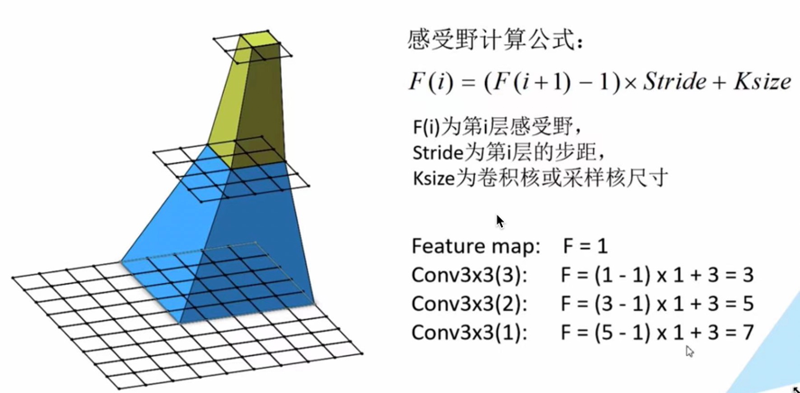
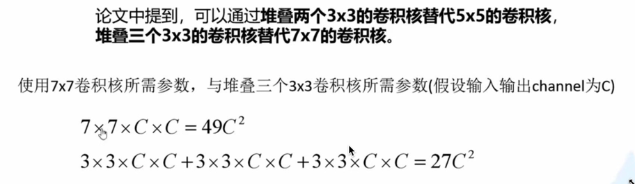
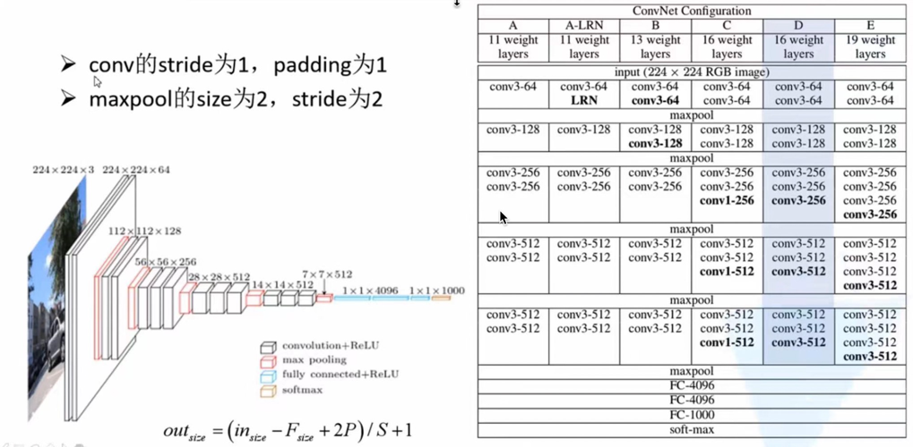

VGG在2014年由牛津大学著名研究组VGG（Visual Geometry Group）提出，斩获该年ImageNet竞赛中Localization Task
第一名和classification task第二名。

《VERY DEEP CONVOLUTIONAL NETWORKS FOR LARGE-SCALE IMAGE RECOGNITION》 ICLR2015
https://arxiv.org/pdf/1409.1556.pdf

网络亮点：
通过堆叠多个3x3卷积核来替代大尺度卷积核（减少网络训练所需参数的数量）
论文中提到：可以通过堆叠两个3x3的卷积核替代5x5的卷积核，堆叠三个3x3的卷积核替代7x7的卷积核。---《拥有相同的感受野》

基础概念扩展：
CNN感受野：在CNN中，决定某一层输出结果中一个元素所对应的输入层的区域大小，被称作感受野（receptive field）。通俗解释是，
输出feature map上的一个单元对应输入层上的区域大小。

如上图，也就是说，通过三层3x3的卷积核卷积之后得到的一个单位对应在原图上的感受野相当于一个7x7的大小，那么也就是说，
这和采用一个7x7大小的卷积核卷积之后得到的感受野是相同的。

参数数量变化：

两个C分别表示输入层和输出层的深度。

网络：

注意：
由于卷积的stride和padding都是1，所以图中经过前面的两个3x3卷积之后的图像的宽高是不变的，只有深度即channel发生了变化，
因为使用了64个卷积核进行卷积，所以深度变为64（224x224x3 ===> 224x224x64）。
池化不改特征矩阵深度/channel，因为图中最大池化/最大下采样的池化核kernel size大小以及stride都是2，所以会将特征图大小尺寸减半。

Tips：本文应用多个小尺寸卷积核代替大卷积核，可达到同等学习效果，同时大大减少网络参数量，可以参考该论文相关实验实验结果。