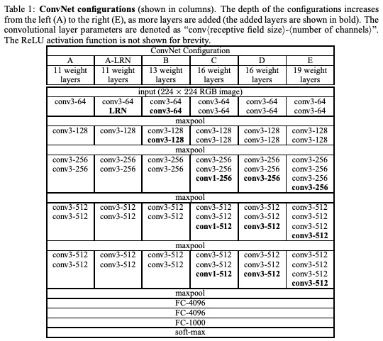

VGG在2014年由牛津大学著名研究组VGG（Visual Geometry Group）提出，斩获该年ImageNet竞赛中Localization Task
第一名和classification task第二名。

《VERY DEEP CONVOLUTIONAL NETWORKS FOR LARGE-SCALE IMAGE RECOGNITION》
https://arxiv.org/pdf/1409.1556.pdf

网络亮点：
通过堆叠多个3*3卷积核来替代大尺度卷积核（减少所需参数）
论文中提到：可以通过堆叠两个3*3的卷积核替代5*5的卷积核，堆叠3个3*3的卷积核替代7*7的卷积核。---《拥有相同的感受野》

基础概念扩展：
CNN感受野：在CNN中，决定某一层输出结果中一个元素所对应的输入层的区域大小，被称作感受野（receptive field）。通俗解释是，
输出feature map上的一个单元对应输入层上的区域大小。