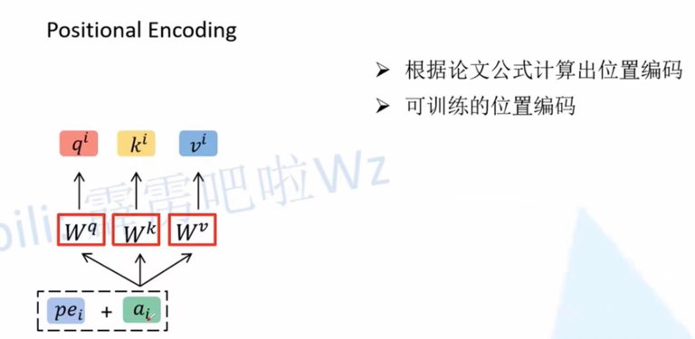

《Attention is all you need》 google 2017 published on Computation and Language 
https://arxiv.org/pdf/1706.03762.pdf
https://blog.csdn.net/qq_37541097/article/details/117691873

针对rnn无法并行化的问题（只能根据t时刻学习t+1时刻的信息），Google提出transformer替代以往的时序网络；
理论上，transformer在不受硬件限制的情况下，网络的记忆长度是可以无限长的；
其次，transformer可以并行化。

如上图所示：假设我们的输入数据 X = [x1, x2]
（1）首先，X会通过一个embedding层被映射到一个更高的维度上[a1, a2]；
（2）紧接着，分别将a1, a2通过W_q, W_k, W_v三个参数矩阵生成对应的Q，K，V；
注意，这里的W_q, W_k, W_v三个参数矩阵对于所有的a都是共享的，在实际源码中，直接通过全连接（nn.Linear）实现。

关于positional encoding，代码中使用的是通过训练的方式得到。

